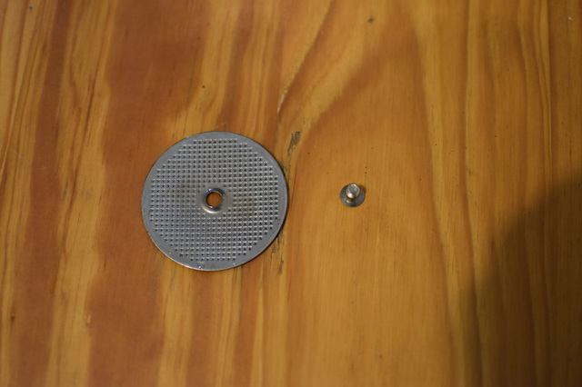

# The CoffeeCherry Pi `base`

This directory is for keeping information about my **Gaggia Classic** and how it should work/be constructed.
The main aim of this is so that I have a reference (including photographs) of how to undo any mods I make - and also to make me think hard before doing anything.

## Contents

* Schematics
  * Parts diagram
  * Wiring diagrams
    * ON State
    * BREW State
    * STEAM State
    * STEAM-BREW State
  * Strip Down
    * Removing the Panarello Steam Wand Attachment
    * Removing the Drip Tray and Tank
    * Removing the Shower Head
    * Removing the Top
    * The Steam Valve
    * Mains Connection
    * The Wiring
    * Removing the Pump
    * The OPV
    * Removing the Solenoid
    * The Boiler
  * Recommended Tools

## Schematics

### Parts diagram

Link: https://wiki.wholelattelove.com/images/6/6a/CLASSIC_Parts_Diagram.pdf

However, it's often easier to remind myself of the simple design of the Gaggia Classic:

### Wiring diagrams

Link: https://wiki.wholelattelove.com/images/a/aa/CLASSIC_Electrical_Diagram.pdf

Link: http://www.gaggiausersgroup.com/index.php?action=ezportal;sa=page;p=42

I found the complete wiring diagram a bit difficult to navigate at first so ended up sketching out the circuits for each switch state.
This made things clear for me at least.

#### ON State

These are the complete circuits when the machine is switched on (at the ON/OFF switch) but the STEAM and BREW switches are left off.
Essentially, in this state two parallel circuits are on: 1) the ON/OFF light and 2) the heating element.
The heating element circuit comprises two thermostats: the coffee thermostat, which trips at 107 C, and the steam thermostat, which trips at 145 C.
Because the coffee thermostat trips at a lower temperature, in this mode the heating elements will be on when the thermostat registers less than 107 C and will be automatically turned off when the thermostat registers 107 C.

Note: my positioning of the the brew light follows the above official schematic; however, I don't think that makes sense.
Given that the light is on when the heating elements are on and off otherwise, I think, and I may be wrong, that the brew light is actually wired after the thermostats and in parallel to the heating element.

#### BREW State

These are the complete circuits when the machine is switched on at the ON/OFF switch and the BREW switch is also on (but the STEAM switch is off).
In this state two additional circuits are activated: 1) the pump, which pumps cold water from the tank into the boiler and thus forces hot water out of the boiler and 2) the solenoid valve, which in this state directs the hot water into the brew head.

#### STEAM State

These are the complete circuits when the machine is switched on at the ON/OFF switch and the STEAM switch is also on (but the BREW switch is off).
The only difference between this and the ON state is that a small circuit bypasses coffee thermostat meaning that the boiler will now heat up until the 145 C steam thermostat trips, which ensures there is high pressure steam inside the boiler.
When you then open the steam valve this steam goes through the steam wand.

#### STEAM+BREW State

These are the complete circuits when the machine is switched on at the ON/OFF switch and the STEAM and BREW switches are also on.
I think this state is only used for priming the machine when you first set it up.
It is the same as the STEAM state, i.e. using the higher temperature thermostat, but also keeps the pump on.
Because the solenoid is still closed water can't go through the brew head.
When the steam valve is opened then steam rushes through the wand but is quickly replaced by the water being pumped into the boiler and so eventually get a solid stream of water from the steam wand.

## Strip Down

As a record of how the machine looked when I started, I have documented a full strip down of my Gaggia Classic below.

Disclaimer: you should only do this if you're experienced or trained an are aware of the dangers.

### Removing the Panarello Steam Wand Attachment

One of the first things I did on getting the Gaggia Classic was remove the Panarello.
I have since replaced the whole steam wand and will, at some point, document this in `additional`.

Removing the Panarello is easy, first pull off the nozzle.

Then unscrew the top part from the seal, pull the seal off and your down.

The left over steam wand actually works fine on it's own, it's just a bit short and not as good as proper steam wand tip.

### Removing the Drip Tray and Tank

Before we do anything we need remove the water tank.
First take out the drip tray.

Then pull the outlet tube out; it's just held in place by a small seal.

And the remove the tank.

### Removing the Shower Head

Removing the shower head is required occasionally for a deep clean (my machine was second hand and I needed to descale the shower head) or if you choose to replace the gasket.
First, lay the machine on it's back.

The shower screen is held on  by a single screw.

Unscrew the shower screen screw with a PH2 head.

Now remove the shower body/holder by unscrewing the two screws using a 5 mm Hex head.

The gasket, the black piece of rubber, is important for ensuring a title seal and high pressure with the portafilter.
If your machine is old or second hand, replacing the gasket is advisable.

### Removing the Top

Now the group head is removed we can start to get into the interior of the machine.
First, remove the lid to the tank funnel.

Then, use a PH1 head to unscrew the two screws at the back.

Given the top a bit of a wiggle and slide it back, beware that the metal top is connected to a ground wire inside the machine so don't pull to hard.
Disconnect the ground wire before you remove the top fully.

Remember: always reconnect the ground to the lid before plugging the machine is; this connection prevents the metal case becoming charged.

### The Steam Valve

There's not really a reason to remove the steam valve but, just for completeness, here it is.
The valve knob just pulls off, but beware there is a small metal spring in here that sometimes pings out.

### Mains Connection

The mains connection is formed of three cables: blue for live, brown for neutral and yellow/green for earth (at least in the UK).
These, like most of the wire connections are spade connections so can be pulled off, just be sure to pull from the connector and not the wire.
There are two other earth connections: one on the lid that you've already disconnected and one attached to the top of the boiler that you can disconnect at this point too.

### The Wiring

WARNING: When I took the wiring out of my machine I took lots of pictures and thought "That'll do, I'll totally be able to wire it all together.".
I was... but only after much scratching my head and comparing my photos to the two wiring diagrams linked above and to my own notes on how I think the machine works.
I managed to get all the wiring in place and the machine still works and doesn't seem to have blow up - yet! - but I wish I'd made more notes on exactly what was connected in what order, especially for multi-terminus wires.

The pumps wiring is pretty simple - a black terminus (left hand side in the photo) connects to the pump between solenoid valve and the ON switch; whilst a red terminus connects the pump to the STEAM switch (see front panel wiring below).

The solenoid valve wiring takes a black terminus from the pump that also connects to the thermal cutoff and the boiler and a blue terminus connecting to the STEAM switch (see front panel wiring below).

The steam thermostat is the one on top of the boiler so easier to access.
It has two connections - a yellow terminus that connects to the boiler and BREW switch (see front panel wiring below) and a white terminus that connects to the brew thermostat (see below).

The brew thermostat is down the side of the boiler, so you may actually have to unwire everything else first but it makes most sense to discuss it after the steam thermostat.
The brew thermostat has a white terminus going between the steam thermostat (see above) and the STEAM switch (see front panel wiring below) and a blue terminus connecting to the ON switch (see front panel wiring below).

There is no wiring for the thermal cut-off, which is secured beneath a piece of metal thus keeping it in contact with the boiler, but I was a little confused when I first saw this so I just thought I'd highlight what it was.
The thermal cut-off connects directly to the mains (neutral).
You can see at this point I've also removed the four boiler connections the yellow one from the steam thermostat (see above), the two black ones which just complete the circuit and the third black terminus that connects to the ON switch (see front panel wiring below).

And then, finally, the front panel.
There's a lot of wires here and many are the same colour (or even the same cable) - this is where detailed notes would save you time in the rebuild.
The wiring diagrams (linked to above) both show wiring for the front panel but here's my summary (left and right are from the point of view behind the panel).

* ON switch: top - blue terminus connecting to the mains (live); middle - another blue terminus connecting to the brew thermostat and the STEAM switch (top left); bottom - black terminus connecting to the pump.
* STEAM switch: top left - blue terminus connecting to the ON switch (middle) and BREW switch (middle); top right - empty; middle left - white terminus connected to the brew thermostat; middle right - red terminus connecting to the pump and the BREW switch (top); bottom left - empty; bottom right - blue terminus connected to the solenoid.
* BREW switch: top - red terminus connected to the STEAM switch; middle - blue terminus connected to the STEAM switch (top left); bottom - yellow terminus connected to the steam thermostat.

### Removing the Pump

The pump can be easily removed by removing the two screws at the base with a PH1 head.
You can also remove the out pipe from the top of the pump with a spanner/

### The OPV

Accessing the OPV and altering the settings to get a lower pressure at the brew head seems to be one of the first mods people make.
From the factory these machines come with 12/13 bar pressure, ideal for pods, but most evidence suggests going for 8-10 bar for freshly ground coffee and some people suggest even lower.
To access the OPV, remove the tubing from the top; if you grab it at the bottom you can pull fairly firmly without doing damage.

Once the tubing is removed you need a 17 mm socket to unscrew the top part of the valve (not the whole thing).
Once this is off there is a small hex opening inside the valve, use a 5 mm hex head to adjust the (anticlockwise for lower pressure).
I don't have a picture of the hex opening itself but will try to add one later.

You can also remove the OPV by unscrewing the two screws at the base (connecting it with the boiler) with a 4 mm hex head.
I did not have an appropriate spanner at the time so did not remove the tubing between the OPV and the pump, you can.
Note that if your boiler has any water left in it, unscrewing the connection with the OPV will let the water flow out - be ready to soak it up.

### Removing the Solenoid

To remove the solenoid we need to first disconnect the outflow tubing which is secured by a small metal clip.
Squeeze the paddles on the clip and slide it halfway up the tubing, remove the tubing by pulling firmly from the base.

Once disconnected the solenoid can now be disconnected from the boiler by unscrewing the two screws at the base with a 4 mm hex head.

At some point in the future I will add a solenoid strip down as I had to do this to remove chalk build up - clearly the person I bought the machine from lived in a hard water area.

### The Steam Wand

The steam wand can be disconnected from the top of the boiler, again using a 4 mm hex head.
You can disconnect the copper piping from the wand itself with a 10 mm spanner, useful when replacing the factory wand with a high quality one.

### The Boiler

By now, all that's left in the machine should be the boiler.
The boiler is actually removed from outside the machine - lay the machine on it's back and, using a 5 mm hex head unscrew the four remaining screws surrounding the brew head.
Be careful as the weight of the boiler will need to be supported as you do this or it will suddenly drop and may do damage to the boiler, the case or you.

Once the boiler has been removed it can be separated into two parts by undoing the four remaining screws with a 4 mm hex head.

## Recommended Tools

For the mods described in this repository you will need the following tools and 'stock' products.

* High-temperature wire (e.g. RS Stock No. 724-4496) - this is the important wire, must be capable of carrying mains voltage and be able to deal with the currents being drawn by the boiler.
* Any old wires (e.g. RS Stock No. 120-9208) - this wire is less important and will be used for connecting the Raspberry Pi to sensors and switches.
* Heat shrink tubing (e.g. RS Stock No. 170-6298) - this shrink wrap is pretty comfortable at high temperatures and is used to protect connections and soldering joints or also just to give an extra layer of protection to wires near the boiler.
* Spade connectors (e.g. RS Stock No. 534-828) - you can't solder wires to the boiler (because it's to hot) so we'll use crimp spade connectors for most of our junctions, get a box set. Note: colour indicates width.

Note: you will also need access to a 3D printer. If you don't have a 3D printer there are many services online that are cheap and quick.
